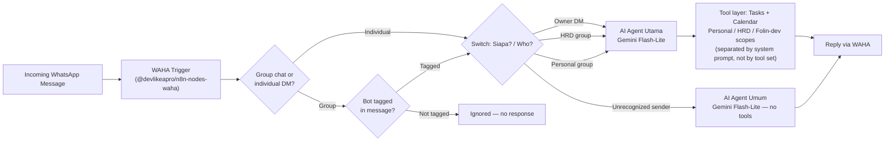

# Folin

**A self-hosted WhatsApp assistant that decides what you can do based on who you are.**

Folin is an n8n-orchestrated AI assistant running over WhatsApp. Instead of giving every user the same flat capabilities, it routes each message through a trust check before it ever reaches an LLM: unrecognized senders get a casual, tool-free conversation; the owner and two designated WhatsApp groups (HRD, Personal) reach a fully-tooled agent that manages Calendar and Tasks across three separate scopes.

> Built to answer a simple question: can a single low-cost deployment safely route four different sender identities into two privilege tiers — without losing track of which scope a request belongs to?

---

## Why this exists

Most "WhatsApp AI bot" tutorials assume one user, one trust level, one purpose. Real use cases aren't like that — an assistant that manages someone's calendar shouldn't treat a stranger's message the same as the owner's, and an HR-facing chatbot needs its own scope of tasks and events. Folin handles that distinction in the routing layer before any LLM call happens, then relies on the agent's own instructions to keep Personal, HRD, and Folin-dev scopes from crossing once it's inside the trusted tier — a deliberate tradeoff that's worth understanding, not a detail to gloss over (see Key engineering decisions below).

---

## Architecture



Four sender categories reach the Switch node, but only two distinct privilege tiers exist downstream: trusted (owner + HRD group + Personal group → full-tool agent) and untrusted (everyone else → casual agent, zero tools). The three trusted identities share one agent definition; the system prompt — not the workflow structure — is what keeps Personal, HRD, and Folin-dev scopes from bleeding into each other.

**Stack:** n8n (self-hosted) · WAHA community node (`@devlikeapro/n8n-nodes-waha`) · Gemini Flash-Lite · Google Calendar & Tasks API · Nginx Proxy Manager · Docker Compose · Biznet Gio NEO Lite VPS (2GB RAM)

---

## Access tiers (RBAC)

The Switch node ("Siapa? / Who?") evaluates the sender against four identities. Two of those map to the same agent and tool access — the real privilege boundary sits between "recognized" and "everyone else," not between each individual branch.

| Switch branch | Who | Routed to | Tool access |
|---|---|---|---|
| Owner | Direct message from the owner's number | AI Agent Utama | Full — Personal, HRD, and Folin-dev scopes, kept separate by system-prompt instruction |
| HRD group | Designated HRD WhatsApp group | AI Agent Utama | Same agent; instructed to use only the HRD scope for this context |
| Personal group | Designated personal WhatsApp group | AI Agent Utama | Same agent; instructed to use only the Personal scope for this context |
| Unrecognized | Any other sender | AI Agent Umum | None — casual conversation only, no tool calls |

Group messages also pass through a tag-gate before reaching the switch: in a group chat, the bot only responds if explicitly mentioned, so it doesn't react to unrelated chatter. Individual DMs skip that gate entirely.

---

## Key engineering decisions

These are the choices that mattered more than the obvious ones (which framework, which language).

**One agent call per message, not three.**
Earlier versions of Folin made up to 3 Gemini API calls per incoming message (intent classification → routing → response generation as separate steps). Consolidated into **one LLM round-trip per message** by moving routing logic into the n8n IF/Switch layer ahead of the agent, instead of asking the LLM to decide routing itself. In practice this is implemented as two agent configurations — "AI Agent Utama" for recognized senders, "AI Agent Umum" for everyone else — selected by the router; whichever path a message takes, it only ever hits one agent, never a chain.

**RBAC enforced at the prompt layer, not the tool layer.**
All three trusted identities (owner, HRD group, Personal group) route to the same agent with every tool attached — Personal, HRD, and Folin-dev scopes for Tasks, Personal and HRD for Calendar. The separation between scopes is a system-prompt instruction ("Personal, HRD, Folin-dev scopes are strictly separate — never mix them"), not a structural restriction on which tools each sender can reach. This trades a hard guarantee for simplicity: one agent definition to maintain instead of three, at the cost of relying on the model to honor the boundary rather than the workflow enforcing it. Worth being upfront about this in an interview — it's a real tradeoff, not a hidden gap.

**Tag-gating before routing, not after.**
In group chats, the bot only proceeds to the routing switch if it's explicitly tagged in the message; individual DMs skip that check. Without it, Folin would respond to every message in the HRD and Personal groups, not just the ones directed at it.

**Gemini over Nemotron.**
Evaluated NVIDIA Nemotron against Gemini Flash-Lite for the underlying LLM. Chose Gemini: the HRD chatbot use case doesn't need Nemotron's heavier reasoning capacity, and Gemini's free-tier limits were sufficient for projected message volume. Picking the bigger model would have been over-engineering for this load profile.

**Routing on context ID, not sender ID alone.**
The switch evaluates `payload.from` — which reflects the group ID when a message arrives inside a group, not the individual sender's personal number. Early versions that checked sender ID without accounting for this mixed up owner-level and group-level access when the owner posted inside the HRD group. Routing on context first avoids that.

**Custom GitHub backup over n8n Source Control.**
n8n's native Source Control is Enterprise-tier only. Built a workflow that exports and pushes workflow JSON to GitHub on a schedule instead — a practical workaround rather than paying for a feature tier this project doesn't otherwise need.

**Sentinel token (`[[SILENT]]`) for scheduled triggers.**
Scheduled (non-reply) triggers occasionally need to produce *no* output — not an empty message, not an error, genuinely nothing sent. Introduced a sentinel token the LLM emits when no notification should fire, checked downstream before the send step. Solves a problem that's easy to ignore until users start getting blank WhatsApp messages at 6 AM.

---

## Constraints

Folin runs on a **2GB RAM VPS** (Biznet Gio NEO Lite), running n8n, WAHA, and Nginx Proxy Manager concurrently via Docker Compose. This wasn't a free choice — it's the constraint the whole architecture was designed around. The API-call consolidation (3→1) wasn't only a cost optimization; it also reduced concurrent execution overhead on a host that doesn't have the headroom to spare.

---

## Setup

```bash
# Clone and configure
git clone <your-repo-url>
cd folin
cp .env.example .env   # fill in Gemini API key, WAHA session config, etc.

# Bring up the stack
docker compose up -d

# Pair the WAHA session (scan QR from logs or WAHA dashboard)
# No manual webhook configuration needed — the WAHA Trigger node
# (community node: @devlikeapro/n8n-nodes-waha) handles event delivery directly.
docker compose logs -f waha
```

n8n workflows are exported as JSON under `/workflows` — import via the n8n editor UI or the backup automation included in this repo.

> Replace `<your-repo-url>` and confirm `.env.example` matches your current variable names before publishing.

---

## Status

- [x] Single LLM round-trip per message (no chained calls)
- [x] 4-branch sender routing collapsing into 2 privilege tiers
- [x] Google Calendar + Tasks integration across 3 scopes (Personal / HRD / Folin-dev)
- [x] Tag-gating for group chats
- [x] GitHub backup automation
- [x] Sentinel-token silent scheduling
- [ ] *(add what's actually next — hard tool-level scope isolation instead of prompt-level, more granular tiers, etc.)*

> Before publishing the workflow JSON itself: scrub the literal sender/group IDs in `payload.from` conditions. They're real WhatsApp identifiers.

---

## Demo

*Add a screenshot or short GIF of an actual WhatsApp conversation here — this matters more for credibility than any paragraph of description.*

---

## License

*Choose one (MIT is the common default for portfolio projects) and add it here.*
